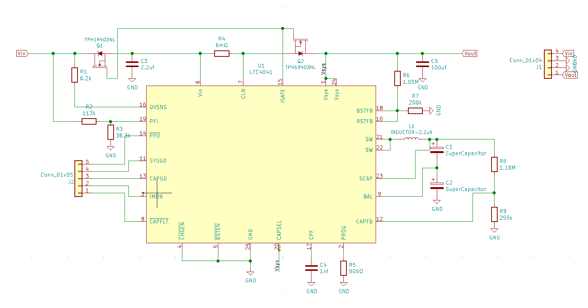
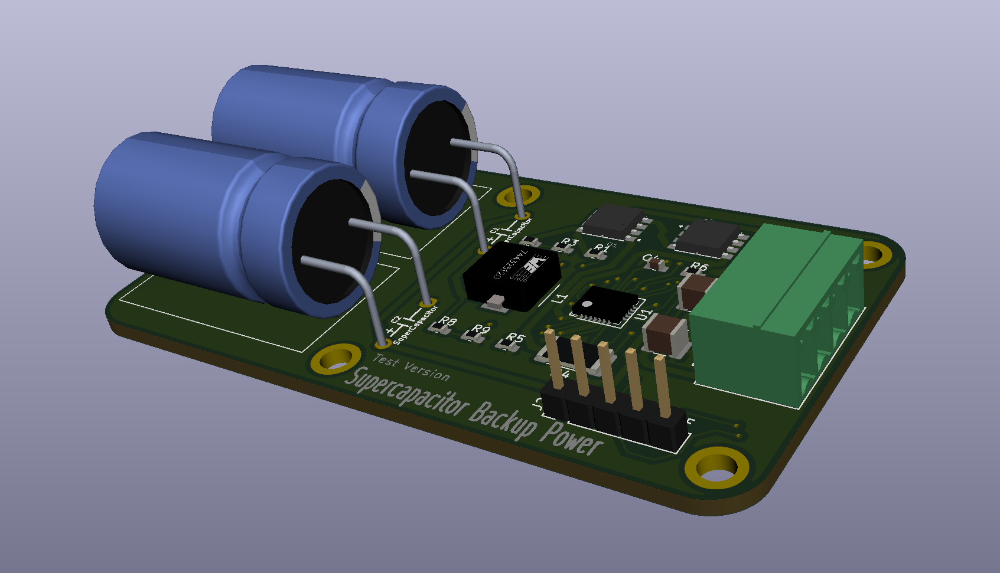

<!--
 * @Author: JunQiLiu
 * @Date: 2020-11-16 19:04:18
 * @LastEditTime: 2020-11-26 02:53:42
 * @Description: 
 * @FilePath: \undefinedc:\Users\JunQiLiu\Documents\SuperCap_UPS\README.md
 * @ 
-->
# SuperCap_UPS
UPS solution based on super capacitor

## Description
* This is a super capacitor UPS,which really has all the UPS functions include a supercapacitor charger and a boost converter,under normal conditions, the input power supply can directly supply power to the load,and when input power is not available,the super capacitor UPS can provide backup power.
* This project is currently in testing

## Hardware Design
The core of this board is **LTC4041**,a power management IC.

> The LTC4041 is a complete supercapacitor backup system for 2.9V to 5.5V supply rails. It contains a high current step-down DC/DC converter to charge a single supercapacitor or two supercapacitors in series. When input power is unavailable, the step-down regulator operates in reverse as a step-up regulator to backup the system output from the supercapacitor(s).

you can visit this website to see details: [LTC4041](https://www.analog.com/en/products/ltc4041.html#product-overview)

For test the functions of this IC,I drew the schematic with reference to the official document.

## Calculating Holdup or Backup Time
[Energy Storage Using Supercapacitors: How Big Is Big Enough?](https://www.analog.com/en/analog-dialogue/raqs/raq-issue-179.html)

## Design Tools
 A Cross Platform and Open Source Electronics Design Automation Suite : [KiCad](https://kicad.org/)

 ## TODO
- [ ] make a PCB 
- [ ] function test